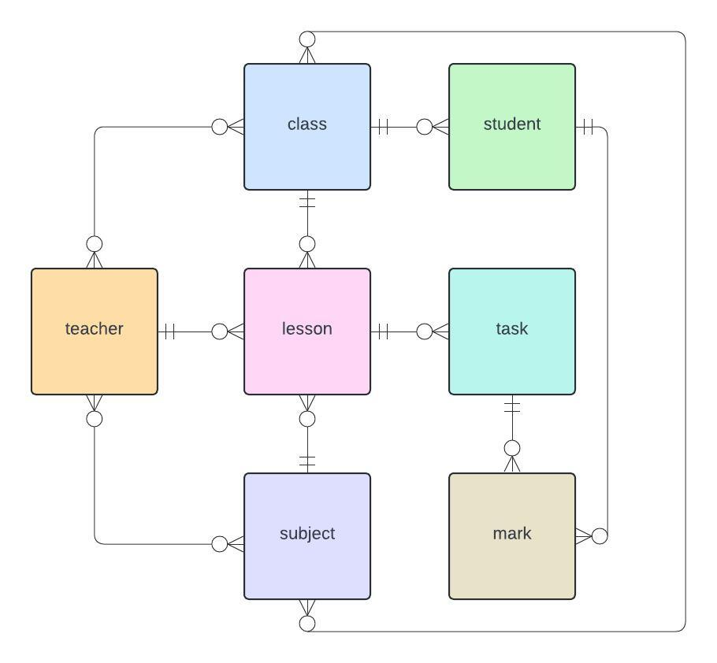
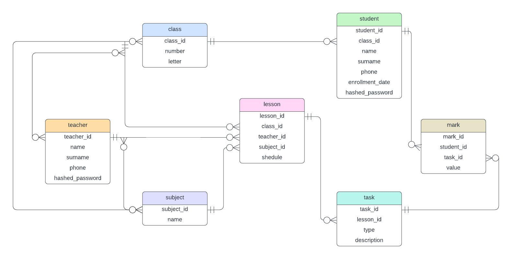
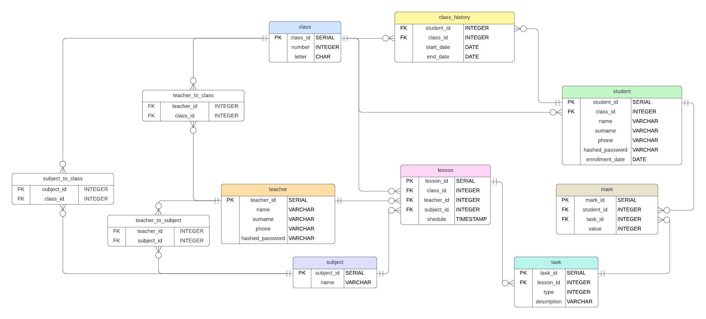

## Проект базы данных *EDiary*

### Описание

Проект представляет собой модель базы данных для школьного электронного журнала.

База данных содержит 7 основных сущностей: ученик, учитель, класс, предмет, урок, задание, оценка. В этой модели
учитель не привязан к конкретным классам, а основное взаимодействие между учеником и учителям осуществляется путем
обьявления уроков, выставления по ним разных типов заданий (классное/домашнее) и управлением оценками за эти задания.

### Концептуальная модель

### Логическая модель

#### SCD 4

Логическая модель поддерживает версионирование информации о классе ученика. Так, можно узнать полную историю обучения
в школе какого-либо ученика по классам, что может быть полезно в целях сбора статистики, оценки качества работы учителей
и рассмотрения частоты перехода между различными классами.

Версионирование имеет тип *SCD 4*: хранится отдельная таблица с историей изменений, в основной таблице хранится только
действительная информация.

#### 3НФ

Модель находится в 3-ей нормальной форме: атомарность атрибутов, минимальная функциональная зависимость от PK,
взаимная независимость атрибутов.

### Физическая модель

**STUDENT**

| Название          | Описание                | Тип данных     | Ограничение                                |
|-------------------|-------------------------|----------------|--------------------------------------------|
| `student_id`      | Идентификатор           | `SERIAL`       | `PRIMARY KEY`                              |
| `class_id`        | Идентификатор класса    | `INTEGER`      | `FOREIGN KEY`   `NOT NULL`             |
| `name`            | Имя ученика             | `VARCHAR(128)` | `NOT NULL`                                 |
| `surname`         | Фамилия ученика         | `VARCHAR(128)` | `NOT NULL`                                 |
| `phone`           | Телефонный номер        | `VARCHAR`      | `LIKE '+7 (___) ___-__-__'`   `UNIQUE` |
| `hashed_password` | Хэшированный пароль     | `VARCHAR`      | `NOT NULL`                                 |
| `enrollment_date` | Дата зачисления в школу | `DATE`         | `NOT NULL`  `DEFAULT now()`            |

**TEACHER**

| Название          | Описание            | Тип данных     | Ограничение                                |
|-------------------|---------------------|----------------|--------------------------------------------|
| `teacher_id`      | Идентификатор       | `SERIAL`       | `PRIMARY KEY`                              |
| `name`            | Имя учителя         | `VARCHAR(128)` | `NOT NULL`                                 |
| `surname`         | Фамилия учителя     | `VARCHAR(128)` | `NOT NULL`                                 |
| `phone`           | Телефонный номер    | `VARCHAR`      | `LIKE '+7 (___) ___-__-__'`   `UNIQUE` |
| `hashed_password` | Хэшированный пароль | `VARCHAR`      | `NOT NULL`                                 |

**CLASS**

Обычно константный набор классов. Может меняться в случае увеличения числа обучающихся. 0 - подготовительный класс.

| Название   | Описание      | Тип данных | Ограничение                    |
|------------|---------------|------------|--------------------------------|
| `class_id` | Идентификатор | `SERIAL`   | `PRIMARY KEY`                  |
| `number`   | Номер класса  | `INTEGER`  | `number >= 0 AND number <= 11` |
| `letter`   | Буква класса  | `CHAR`     | `NOT NULL`                     |

**SUBJECT**

| Название     | Описание          | Тип данных     | Ограничение              |
|--------------|-------------------|----------------|--------------------------|
| `subject_id` | Идентификатор     | `SERIAL`       | `PRIMARY KEY`            |
| `name`       | Название предмета | `VARCHAR(128)` | `NOT NULL`  `UNIQUE` |

**LESSON**

Каждый урок - отдельная запись в таблице.

| Название     | Описание               | Тип данных  | Ограничение                    |
|--------------|------------------------|-------------|--------------------------------|
| `lesson_id`  | Идентификатор          | `SERIAL`    | `PRIMARY KEY`                  |
| `class_id`   | Идентификатор класса   | `INTEGER`   | `FOREIGN KEY`   `NOT NULL` |
| `teacher_id` | Идентификатор учителя  | `INTEGER`   | `FOREIGN KEY`   `NOT NULL` |
| `subject_id` | Идентификатор предмета | `INTEGER`   | `FOREIGN KEY`   `NOT NULL` |
| `shedule`    | Дата+время урока       | `TIMESTAMP` | `NOT NULL`                     |

**TASK**

У одного урока может быть несколько задач.

| Название      | Описание                                 | Тип данных      | Ограничение                    |
|---------------|------------------------------------------|-----------------|--------------------------------|
| `task_id`     | Идентификатор                            | `SERIAL`        | `PRIMARY KEY`                  |
| `lesson_id`   | Идентификатор урока                      | `INTEGER`       | `FOREIGN KEY`   `NOT NULL` |
| `type`        | Тип задания (классное - 0, домашнее - 1) | `INTEGER`       | `IN (0, 1)`                    |
| `description` | Описание задания                         | `VARCHAR(2000)` |                                |

**MARK**

За одно задание может быть выставленно несколько оценок. Обратившись к заданию и урока можно понять: кто и за что
поставил
оценку. Оценка 0 - точка(долг).

P.S. оценка 1 тоже существует, проверенно на собственном опыте.

| Название     | Описание               | Тип данных | Ограничение                    |
|--------------|------------------------|------------|--------------------------------|
| `mark_id`    | Идентификатор          | `SERIAL`   | `PRIMARY KEY`                  |
| `student_id` | Идентификатор ученика  | `INTEGER`  | `FOREIGN KEY`   `NOT NULL` |
| `task_id`    | Индентификатор задания | `INTEGER`  | `FOREIGN KEY`   `NOT NULL` |
| `value`      | Оценка                 | `INTEGER`  | `IN (0, 1, 2, 3, 4, 5)`        |

**CLASS_HISTORY**

Информация о всех классах, в которых учился ученик.

| Название     | Описание                         | Тип данных | Ограничение                                                     |
|--------------|----------------------------------|------------|-----------------------------------------------------------------|
| `student_id` | Идентификатор ученика            | `INTEGER`  | `FOREIGN KEY`   `NOT NULL`                                  |
| `class_id`   | Идентификатор класса             | `INTEGER`  | `FOREIGN KEY`   `NOT NULL`                                  |
| `start_date` | Дата начала обучения в классе    | `DATE`     | `NOT NULL`                                                      |
| `end_date`   | Дата окончания обучения в классе | `DATE`     | `NOT NULL`   `DEFAULT now()`   `end_date >= start_date` |

**Таблицы-связки**

**SUBJECT_TO_CLASS**

| Название     | Описание               | Тип данных | Ограничение                    |
|--------------|------------------------|------------|--------------------------------|
| `subject_id` | Идентификатор предмета | `INTEGER`  | `FOREIGN KEY`   `NOT NULL` |
| `class_id`   | Идентификатор класса   | `INTEGER`  | `FOREIGN KEY`   `NOT NULL` |

**TEACHER_TO_CLASS**

| Название     | Описание              | Тип данных | Ограничение                    |
|--------------|-----------------------|------------|--------------------------------|
| `teacher_id` | Идентификатор учителя | `INTEGER`  | `FOREIGN KEY`   `NOT NULL` |
| `class_id`   | Идентификатор класса  | `INTEGER`  | `FOREIGN KEY`   `NOT NULL` |

**TEACHER_TO_SUBJECT**

| Название     | Описание               | Тип данных | Ограничение                    |
|--------------|------------------------|------------|--------------------------------|
| `teacher_id` | Идентификатор учителя  | `INTEGER`  | `FOREIGN KEY`   `NOT NULL` |
| `subject_id` | Идентификатор предмета | `INTEGER`  | `FOREIGN KEY`   `NOT NULL` |

**Дополнительные ограничения**

| Название                | Описание                                         | Таблица  | Ограничение                     |
|-------------------------|--------------------------------------------------|----------|---------------------------------|
| `one_lesson_at_time`    | Не более 1 урока в одно время у одного класса    | `lesson` | `UNIQUE (class_id, shedule)`    |
| `unique_number_letter`  | Нет классов с одинаковой комбинацией число-буква | `class`  | `UNIQUE (number, letter)`       |
| `teacher_time_conflict` | У одного учителя - один урок в одно время        | `class`  | `UNIQUE (teacher_id, schedule)` |

### [Запросы к БД](scripts/requests)

### [Функции](scripts/functions)

### [Триггеры](scripts/triggers)