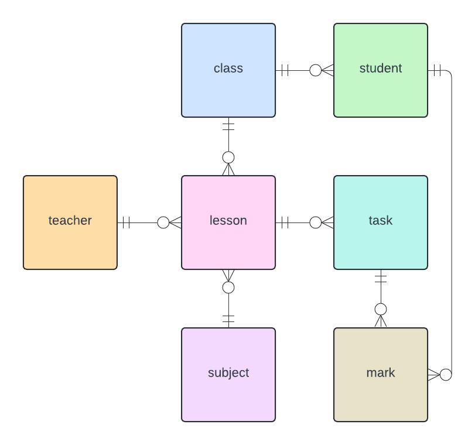
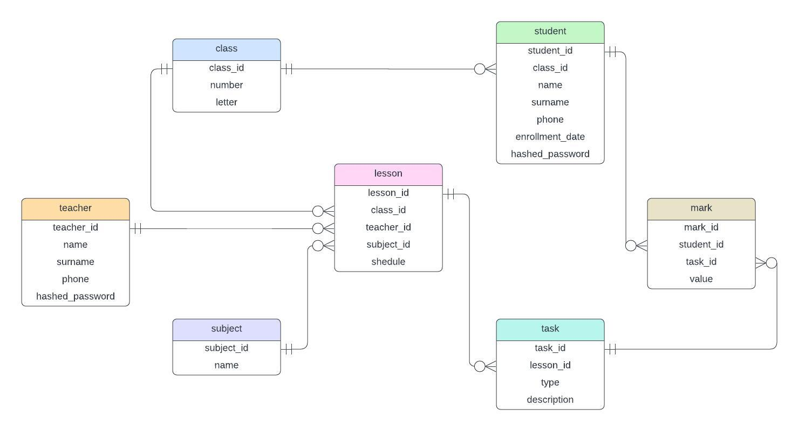

## Проект базы данных *Electronic Diary*

### Описание

Проект представляетс модель базы данных для школьного электронного журнала.

База данных содержит 7 основных сущностей: ученик, учитель, класс, предмет, урок, задание, оценка. В этой модели
учитель не привязан к конкретным классам, а основное взаимодействие между учеником и учителям осуществляется путем
обьявления уроков, выставления по ним разных типов заданий (классное/домашнее) и управлением оценками за эти задания.

### Концептуальная модель

### Логическая модель

#### SCD 4

Логическая модель поддерживает версионирование информации о классе ученика. Так, можно узнать полную историю обучения
в школе какого-либо ученика по классам, что может быть полезно в целях сбора статистики, оценки качества работы учителей
и рассмотрения частоты перехода между различными классами.

Версионирование имеет тип *SCD 4*: хранится отдельная таблица с историей изменений, в основной таблице хранится только
действительная информация.

#### 3НФ

Модель находится в 3-ей нормальной форме: атомарность атрибутов, минимальная функциональная зависимость от PK,
взаимная независимость атрибутов.
